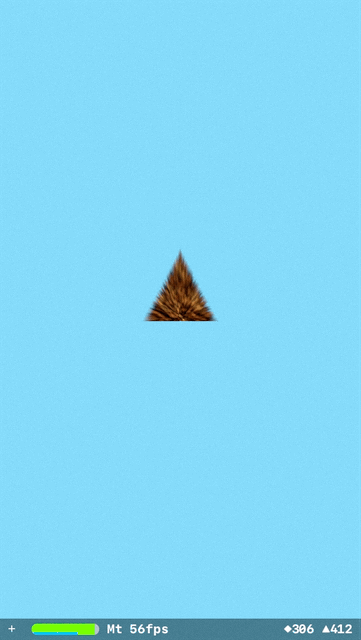

# Scenekit Fur

Way of displaying animal fur on scenkit nodes without using shaders.

This isn't really the best way of doing this but, just an experiment to see if it could be done without shaders.

 

